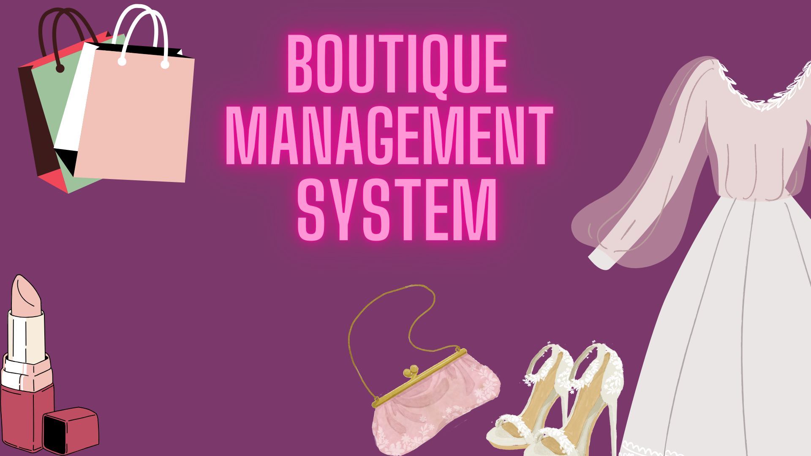
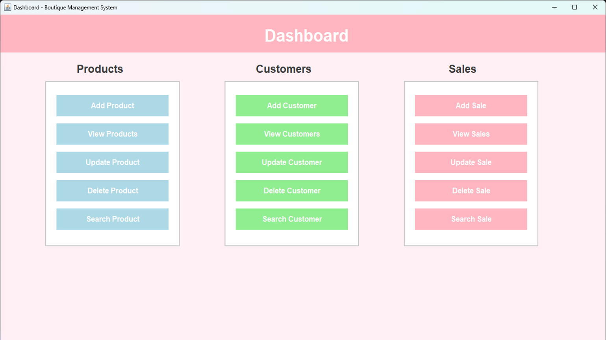

# 🛍️ Boutique Management System

A desktop application built with **Java Swing** and **MySQL** that streamlines day-to-day boutique operations — from managing inventory and customers to tracking sales — all through a clean, intuitive interface.

---

## 📸 Screenshots

| Splash Screen | Dashboard |
|---|---|
|  |  |

---

## ✨ Features

- 🔐 **Login Screen** — Secure entry point with a boutique-themed splash UI
- 📦 **Product Management** — Add, view, update, delete, and search products
- 👥 **Customer Management** — Maintain a complete customer database with full CRUD support
- 💰 **Sales Management** — Record, track, update, and search sales transactions
- 🗄️ **Persistent Storage** — All data stored and retrieved via MySQL database

---

## 🛠️ Tech Stack

| Layer | Technology |
|---|---|
| Programming Language | Java |
| GUI Toolkit | Java Swing |
| Database | MySQL |

---

## 🚀 Getting Started

### Prerequisites

- Java JDK 8 or higher
- MySQL Server
- Any Java IDE (IntelliJ IDEA, Eclipse, NetBeans)

---

## 📄 License

This project is licensed under the MIT License — see the [LICENSE](LICENSE) file for details.

---

Made with ❤️ using Java & MySQL

